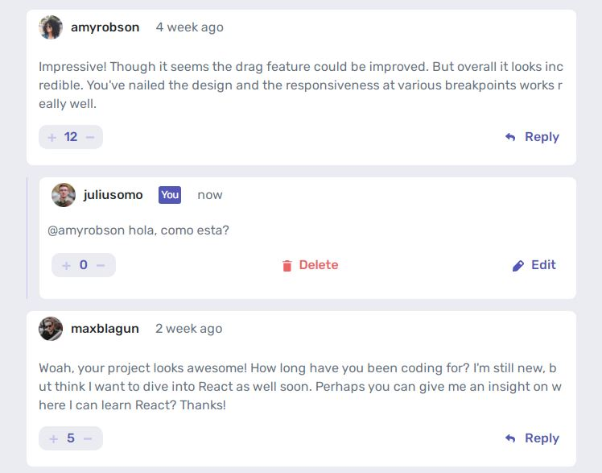

# Frontend Mentor - Interactive comments section solution

This is a solution to the [Interactive comments section challenge on Frontend Mentor](https://www.frontendmentor.io/challenges/interactive-comments-section-iG1RugEG9). Frontend Mentor challenges help you improve your coding skills by building realistic projects. 

## Table of contents

- [Overview](#overview)
  - [The challenge](#the-challenge)
  - [Screenshot](#screenshot)
  - [Links](#links)
- [My process](#my-process)
  - [Built with](#built-with)

**Note: Delete this note and update the table of contents based on what sections you keep.**

## Overview

### The challenge

Users should be able to:

- View the optimal layout for the app depending on their device's screen size
- See hover states for all interactive elements on the page
- Create, Read, Update, and Delete comments and replies
- Upvote and downvote comments
- **Bonus**: If you're building a purely front-end project, use `localStorage` to save the current state in the browser that persists when the browser is refreshed.
- **Bonus**: Instead of using the `createdAt` strings from the `data.json` file, try using timestamps and dynamically track the time since the comment or reply was posted.

### Screenshot

### Links

- Solution URL: [Add solution URL here](https://github.com/jhovannyvivas/caja_de_comentarios_simulada.git)
- Live Site URL: [Add live site URL here](https://jhovannyvivas.github.io/caja_de_comentarios_simulada/)

## My process

The first thing I did was show the comments in the html, then I decided to use angular js, precisely to show the comments easily. Then I started to do the functions that added a new comment. Then the functions that remove comments. Then I made a function so that the page would show the box where a replica was going to be made. The last thing I did was put the dates of the new comments.

### Built with

- Semantic HTML5 markup
- CSS custom properties
- Mobile-first workflow
- [Angular js](https://docs.angularjs.org/guide) - JS library
- [Bootstrap](https://getbootstrap.com/) - CSS library
- [Styled Components](https://styled-components.com/) - For styles

